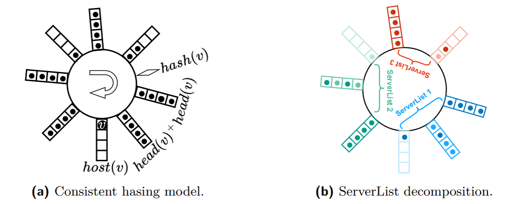
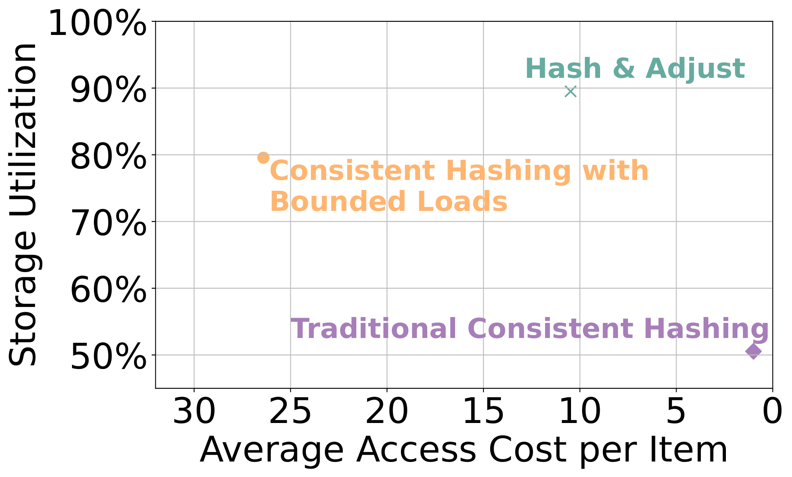

# Hash-And-Adjust

Experimentation-code for the publication "Hash & Adjust: Competitive Demand-Aware Consistent Hashing".

We leverage consistent hashing to develop *H&A*, a demand-aware, constant-competitive algorithm that enhances 
storage utilization and access efficiency while providing robust performance guarantees.
This approach is particularly beneficial for distributed systems, which manage dynamic workloads and demand adaptive mechanisms.

## Consistent Hashing

Consistent hashing maps data to specific hosts using a hash function for efficient allocation and retrieval. 
In this paper we partition the hosts (servers) into subsequences of servers (ServerLists). 
Data-items are inserted at the beginning of the partition (=*head*) and forwarded to the subsequent servers, until a free spot is found.
This way, non-full servers must be at the end of each partition: this is how isolated interactions are insured. 
That is, when we search for an item, we just need to go from head until the next non-full server.



*Figure a* illustrates an example of our model with 8 servers, each having a capacity of 4 items. 
In this scenario, item v was initially assigned to server head(v) (the closest hash value). 
However, since *head(v)* and *head(v)+* were full, the item was relocated to *host(v)*. 
*Figure b* demonstrates the decomposition of this example into ServerLists, with each ServerList represented by a distinct color. 
Servers within a ServerList are shaded with varying gradients of the same color to indicate their roles as different heads.
Items are colored to match their respective server.

The following plot, which can be generated by starting  *Experiment 1* (see ```main.py```), 
illustrates the storage utilization benefits of this data-structure, combined with the access-cost efficiency of *H&A*:



## Run the evaluation code

Following a short guide on how to reproduce the plots of the publication.

### Dependencies

To run the simulation-code, the modules ```bitstring```, ```scipy``` and ```pandas``` are required.

For the plotting functionality, other packages such as ```seaborn``` are used. A detailed list can be found in ```requirements.txt```. 

### Experiments

The experimentation code can be found in ```implementation```. 
It fetches the datasets from ```data``` and generates data in ```data_handling```.

#### Experiment setup

We advise to use PyCharm (it offers the possibility to take care of the dependencies) and set the working directory to the parent folder ``` .\Hash-And-Adjust\ ```.

#### Run the experiments

All relevant experiments can be run from ```main.py``` in the root folder. The output will be saved in the ```results``` folder.

#### Data

Temporal-locality data can be generated on the fly. We uploaded the click-dataset to ```data```, 
while the CAIDA-Dataset needs to be requested from the official source.

### Plotting

The plotting code can be found in the ```plotter.py``` file: 
it uses the output from ```results``` and can be run independently from the experimentation code (see comments in ```main.py```).
Generated plots are saved in the ```plots``` folder.
